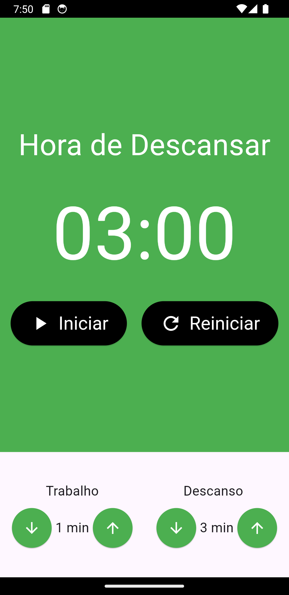
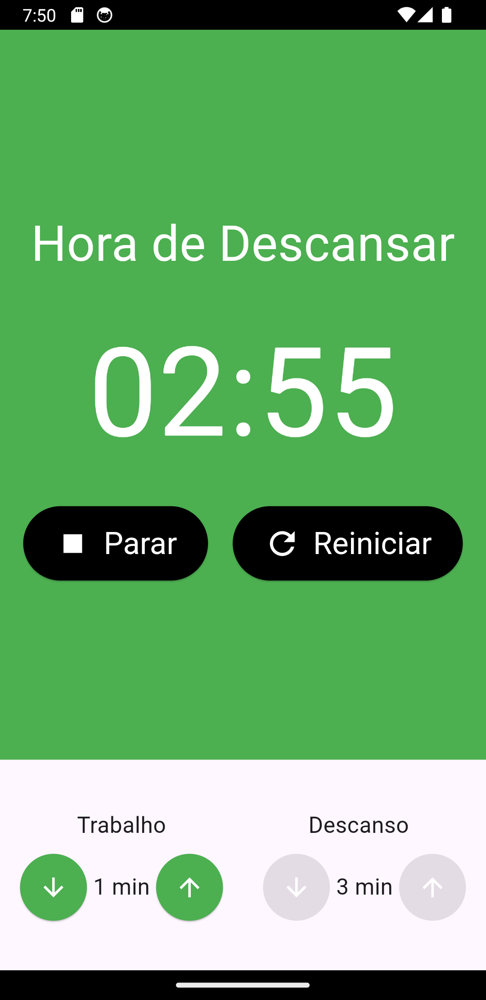
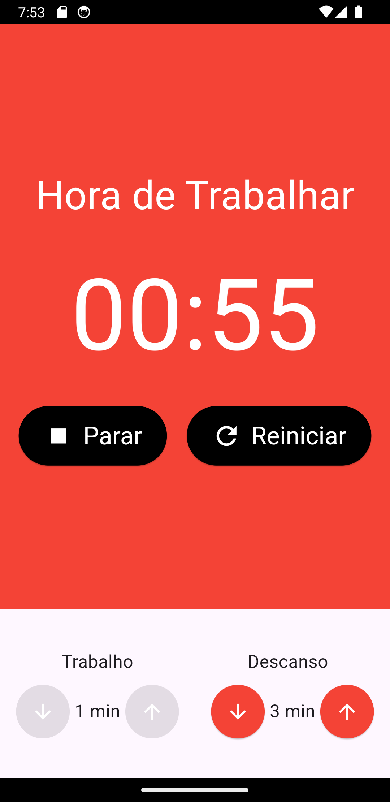

# Relógio Pomodoro 

Este é um aplicativo de Relógio Pomodoro desenvolvido em Flutter, uma estrutura de desenvolvimento de aplicativos móveis multiplataforma. Ele utiliza o MobX para o gerenciamento de estado, proporcionando uma experiência suave e eficiente.

## Visão Geral

O Relógio Pomodoro é uma técnica de gestão de tempo desenvolvida para melhorar a produtividade e a concentração. Consiste em dividir o trabalho em períodos de tempo cronometrados, geralmente 25 minutos, separados por breves intervalos. Este aplicativo implementa essa técnica de forma digital, oferecendo um timer configurável e notificações para marcar o início e o término de cada ciclo.

  

## Funcionalidades Principais

- **Timer Pomodoro**: Configure o tempo de trabalho e de pausa de acordo com suas preferências.

## Requisitos do Sistema

- Dispositivos Android com versão 4.1 ou superior.
- Dispositivos iOS com versão 8.0 ou superior.

## Instalação

1. Certifique-se de ter o Flutter instalado em seu sistema. Para mais informações, consulte a [documentação oficial do Flutter](https://flutter.dev/docs/get-started/install).
2. Clone este repositório para o seu ambiente local.
3. Navegue até o diretório do projeto e execute `flutter pub get` para instalar as dependências.
4. Execute o aplicativo em um emulador ou dispositivo físico com o comando `flutter run`.

## Configuração

Personalize as configurações do aplicativo conforme necessário.

## Gerenciamento de Estado

Este aplicativo utiliza o MobX para o gerenciamento de estado, garantindo uma manipulação eficiente e organizada dos dados em toda a aplicação.

## Contribuindo

Contribuições são bem-vindas! Se você tiver sugestões de melhorias, novos recursos ou correções de bugs, sinta-se à vontade para abrir uma issue ou enviar um pull request.

## Licença

Este projeto está licenciado sob a [Licença MIT](https://opensource.org/licenses/MIT) - veja o arquivo [LICENSE](LICENSE) para detalhes.
